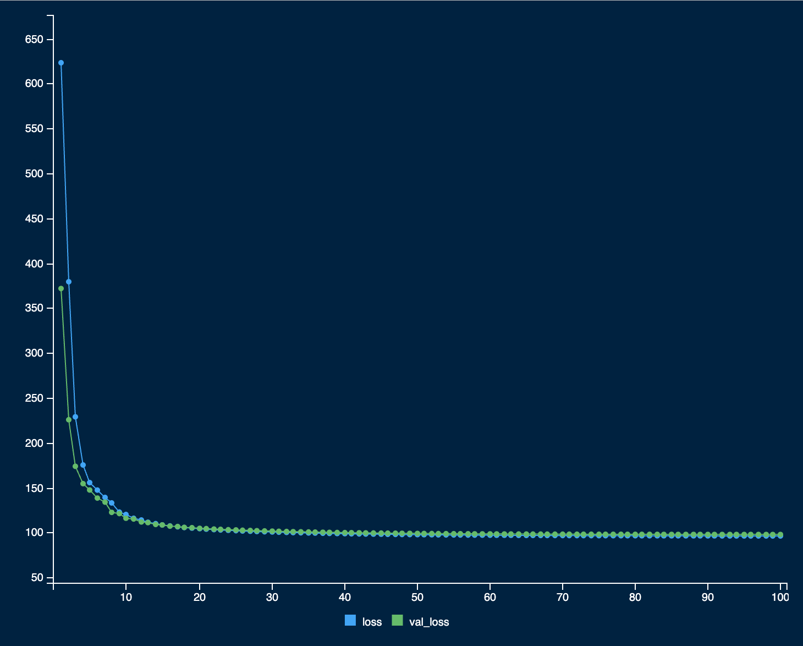
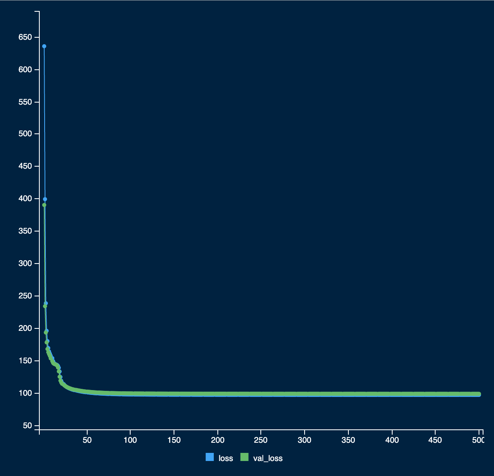
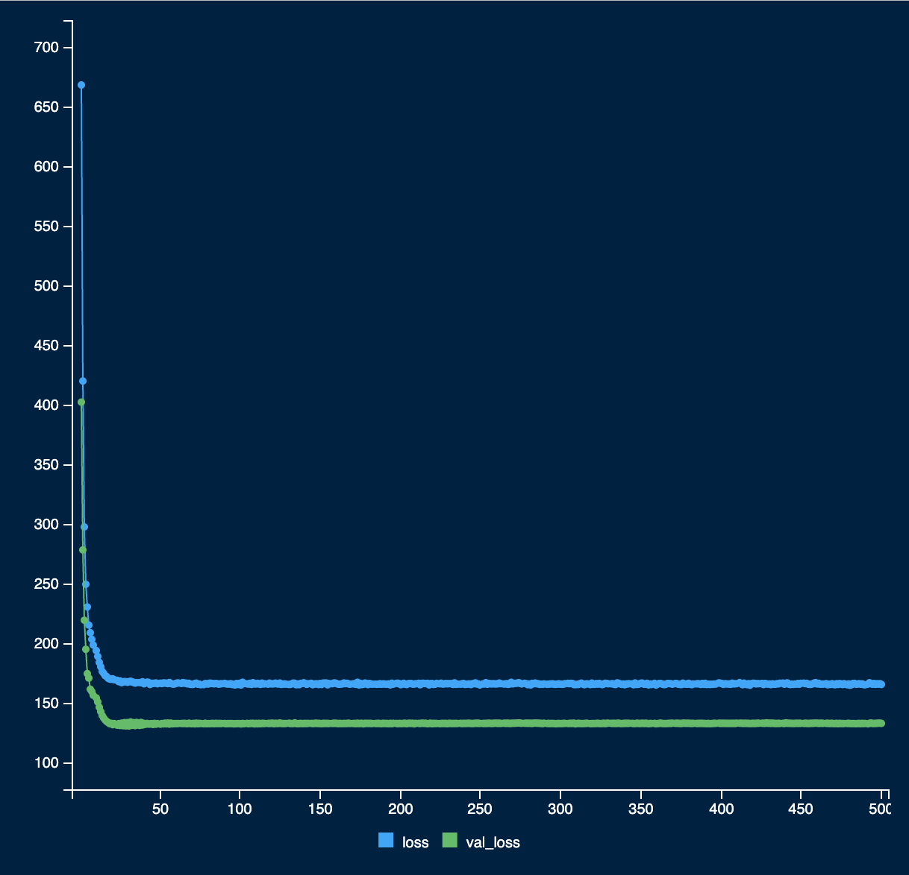
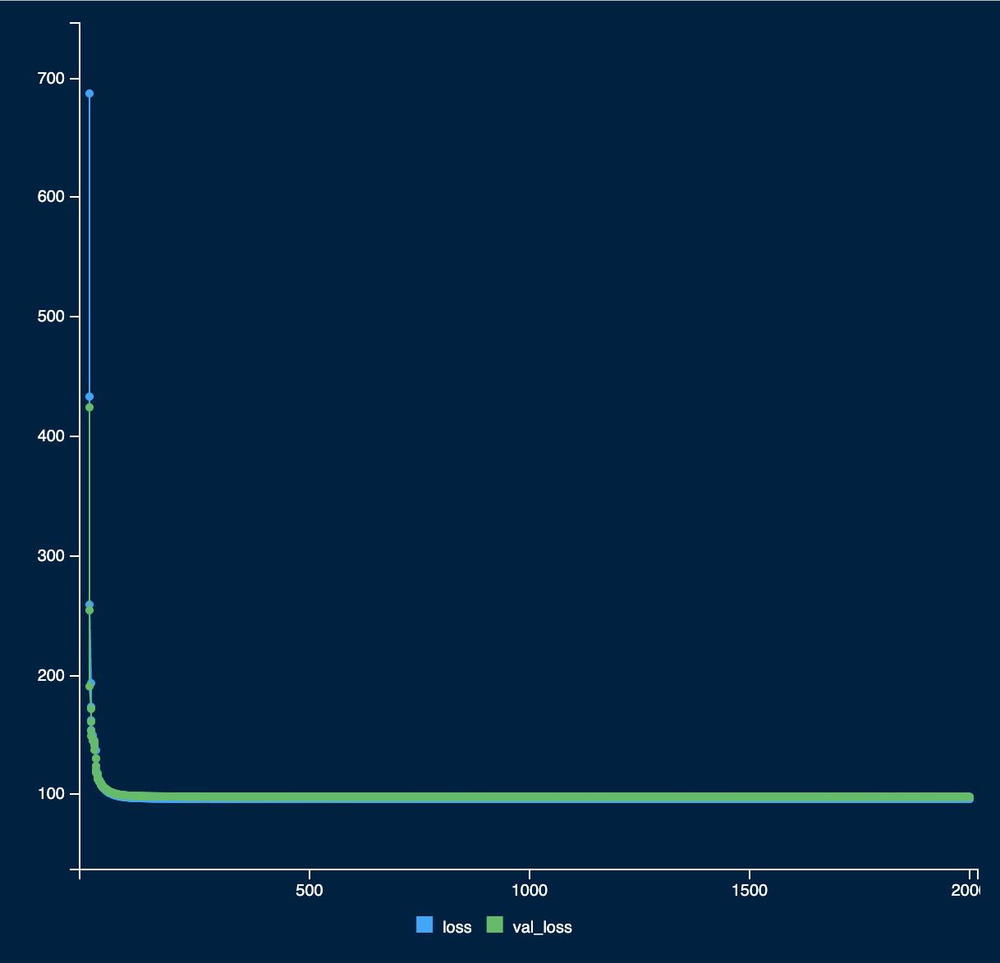
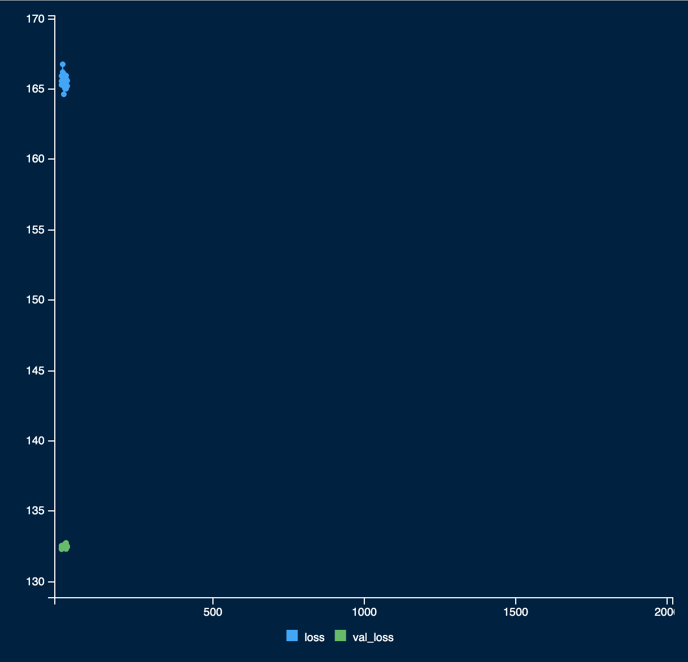
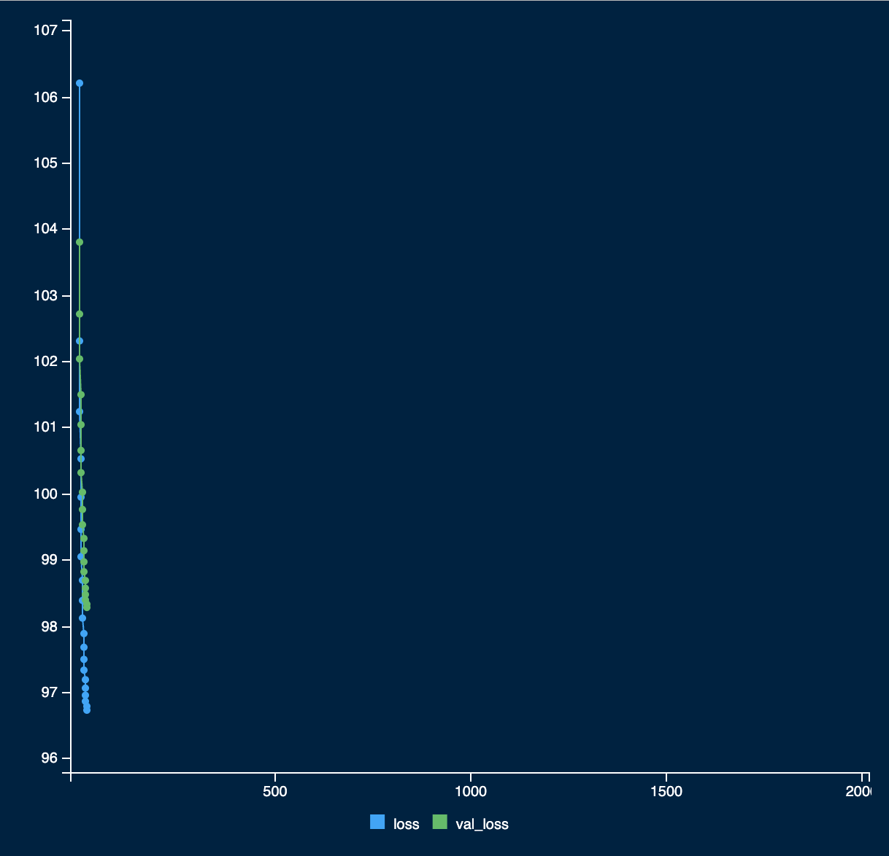

# Recapitulando

Aprendi que o R Markdown existe! A Lista 1 é um arquivo bruto em R infelizmente.

Para a Lista 2, preciso de tudo de antes da Lista 1!

Passar a limpo as coisas da lista 1 para esse markdown me ajudou a identificar alguns erros na minha implementação. Voltei e arrumei eles, aparentemente.

Lição aprendida, R Markdown é ótimo!

```{r}

library(latex2exp)
library(NeuralNetTools)
library(tidyverse)
library(microbenchmark)
```

```{r}

### Arquitetura da RNA (como dado na lista de exercícios)
par(mar=c(0, 0, 0, 0))
wts_in <- rep(1, 9)
struct <- c(2, 2, 1) # dois inputs, dois neurônios escondidos e um otput
plotnet(wts_in, struct = struct,
        x_names="", y_names="",
        node_labs=F, rel_rsc=.7)
aux <- list(
  x=c(-.8, -.8, 0, 0, .8, rep(-.55, 4), -.12, -0.06, .38, .38, .7),
  y=c(.73, .28, .73, .28, .5, .78, .68, .48, .32, .88, .5, .68, .44, .7),
  rotulo=c("x_1", "x_2", "h_1", "h_2", "\\hat{y}", paste0("w_", 1:4),
           "b_1", "b_2", "w_5", "w_6", "b_3")
)
walk(transpose(aux), ~ text(.$x, .$y,
                            TeX(str_c("$", .$rotulo, "$")), cex=.8))

```

Dados da questão

```{r}

# Como dado na questão

set.seed(1.2026)

m.obs <- 100000

dados <- tibble(
  x1 = runif(m.obs, -3, 3),
  x2 = runif(m.obs, -3, 3)
) %>%
  mutate(
    mu = abs(x1^3 - 30*sin(x2) + 10),
    y  = rnorm(m.obs, mean = mu, sd = 1)
  )

# "primeiras 80.000 amostras componham o conjunto de treinamento"
dados_train <- dados[1:80000, ]

# próximas 10.000 o de validação
dados_val   <- dados[80001:90000, ]

# últimas 10.000 o de teste
dados_test  <- dados[90001:100000, ]

sigmoid <- function(z) {
  1 / (1 + exp(-z))
}
```

```{r}

# Função predict da rede
# calcula um y_chapeu dado x, pesos e bias
predict_nn <- function(x, pesos, bias) {
  
  # desempacotar pesos
  w1 <- pesos[1]; w2 <- pesos[2]
  w3 <- pesos[3]; w4 <- pesos[4]
  w5 <- pesos[5]; w6 <- pesos[6]
  
  # desempacotar bias
  b1 <- bias[1]; b2 <- bias[2]; b3 <- bias[3]
  
  # funcão y_chapeu
  a1 <- x[1]*w1 + x[2]*w3 + b1
  a2 <- x[1]*w2 + x[2]*w4 + b2
  
  h1 <- sigmoid(a1)
  h2 <- sigmoid(a2)
  
  y_chapeu <- h1*w5 + h2*w6 + b3
  
  return(list(
    y_chapeu = y_chapeu,
    h1    = h1,
    h2    = h2, 
    a1    = a1, 
    a2    = a2
  ))
  
}

# w1, w2, ..., w9
pesos_iniciais <- rep(0.1, 6)

# b1, b2, b3
bias_iniciais <- rep(0.1, 3)

# vetor de input x: 1, 1
x <- c(1, 1)

result_forward <- predict_nn(x, pesos = pesos_iniciais, bias = bias_iniciais)
y_chapeu <- result_forward$y_chapeu
```

```{r}

# o gradiente calcula isso do passo anterior
# faz a derivada
# atualiza peso e bias

grad_nn <- function(pesos, bias, X, y) {
  
  out <- predict_nn(X, pesos, bias)
  y_chapeu <- out$y_chapeu
  
  h1 <- out$h1 # valor na rede - h1
  h2 <- out$h2 # valor na rede - h2
  
  # as partes de y_chapeu
  a1 <- out$a1 # x[1]*w1 + x[2]*w3 + b1
  a2 <- out$a2 # x[1]*w2 + x[2]*w4 + b2
  
  x1 <- X[, 1]
  x2 <- X[, 2]
  
  # BACKWARD (uma vez só)
  delta3 <- 2 * (y_chapeu - y)                 
  
  dw5 <- mean(delta3 * h1)
  dw6 <- mean(delta3 * h2)
  db3 <- mean(delta3)
  
  delta1 <- delta3 * pesos[5] * h1 * (1 - h1)    
  delta2 <- delta3 * pesos[6] * h2 * (1 - h2)     
  
  dw1 <- mean(delta1 * x1)
  dw3 <- mean(delta1 * x2)
  db1 <- mean(delta1)
  
  dw2 <- mean(delta2 * x1)
  dw4 <- mean(delta2 * x2)
  db2 <- mean(delta2)
  
  list(
    grad_pesos = c(dw1, dw2, dw3, dw4, dw5, dw6),
    grad_bias  = c(db1, db2, db3),
    cache = list(y_chapeu = y_chapeu, h1 = h1, h2 = h2, a1 = a1, a2 = a2)
  )
}

# w1, w2, ..., w9
pesos_iniciais <- rep(0.1, 6)

# b1, b2, b3
bias_iniciais <- rep(0.1, 3)

# dados de treino
X_train <- as.matrix(dados_train[, c("x1", "x2")])

# Outputs de treino para aplicar no erro quadratico medio
y_treino <- dados_train$y

# teste
g <- grad_nn(pesos_iniciais, bias_iniciais, X_train, y_treino)
print(g)
```

```{r}

# aqui se calcula o erro quadratico médio entre y real e y previsto no predict
custo_nn <- function(pesos_custo, bias_custo, X, y) {
  res <- apply(X, 1, predict_nn, pesos = pesos_custo, bias = bias_custo)
  y_chapeu <- sapply(res, `[[`, "y_chapeu") 
  mean((y - y_chapeu)^2)
}
```

```{r}

# Herdando do ITEM E

# Aplicar o método de gradiente com
# taxa de aprendizagem = 0.1
# 100 iteraões minimizando a funcão de custo

# a atualizacão dos pesos/bias é dado por
# pesos = pesos - * (taxa_aprendizagem * gradiente_pesos)
# bias = bias - * (taxa_aprendizagem * gradiente_bias)

X_treino <- as.matrix(dados_train[, c("x1","x2")])
y_treino <- dados_train$y

X_val <- as.matrix(dados_val[, c("x1","x2")])
y_val <- dados_val$y
 
X_teste <- as.matrix(dados_test[, c("x1","x2")])
y_teste <- dados_test$y

eps <- 0.1
n_iter <- 100

pesos <- rep(0, 6)
bias  <- rep(0, 3)

hist_train <- numeric(n_iter)
hist_val   <- numeric(n_iter)
 
best_val <- Inf
best_iter <- NA
best_pesos <- NULL
best_bias  <- NULL
 
# wrapper par prever em um dataset X (matriz n×2)
pred_y_chapeu <- function(X, pesos, bias) {
  out <- lapply(1:nrow(X), function(i) predict_nn(X[i, ], pesos = pesos, bias = bias))
  sapply(out, `[[`, "y_chapeu")  # vetor numérico (n)
}

#Full Gradient Descent
for (t in 1:n_iter) {
   
  # gradiente no treino
  g <- grad_nn(pesos, bias, X_treino, y_treino)
     
  # atualização (descida)
  pesos <- pesos - eps * g$grad_pesos
  bias  <- bias  - eps * g$grad_bias
     
  # custos (para monitorar)
  hist_train[t] <- custo_nn(pesos, bias, X_treino, y_treino)
  
  # na nova implementação não precisa calcular isso
  # mas deixa
  hist_val[t]   <- custo_nn(pesos, bias, X_val, y_val)
     
  # melhor validação
  if (hist_val[t] < best_val) {
    best_val <- hist_val[t]
    best_iter <- t
    best_pesos <- pesos
    best_bias  <- bias
  }
     
  #print(t)
  # vou dar predict para pegar o y_chapeu
  best_y_hat_test <- pred_y_chapeu(X_teste, best_pesos, best_bias)
}
 

# dai aqui é os resultados da questão
best_val
best_iter
best_pesos
best_bias 
```

```{r}

# se tudo deu certo, essas dimensões aqui batem

length(best_y_hat_test) == nrow(X_teste)
```

```{r}

# resultado final do treino
df_test <- dados_test %>%
  mutate(
    y_hat = best_y_hat_test,
    resid = y - y_hat
  )

ggplot(df_test, aes(x = y_hat, y = y)) +
  geom_point(alpha = 0.35, size = 1) +
  geom_abline(intercept = 0, slope = 1,
              colour = "red", linetype = "dashed", linewidth = 1) +
  coord_cartesian(xlim = range(df_test$y_hat) + c(-0.1, 0.1)) +
  labs(
    x = expression(hat(y)),
    y = "y observado",
    title = "Valores observados vs. valores previstos"
  )
```

Os valores estão picotados entre 10 e 22.

```{r}

plot(
  hist_train,
  type = "l",
  lwd = 2,
  col = "blue",
  xlab = "Iteração",
  ylab = "Custo (MSE)",
  ylim = range(c(hist_train, hist_val)),
  main = "Custo no treino e validação"
)

lines(
  hist_val,
  lwd = 2,
  col = "red",
  lty = 2
)

legend(
  "topright",
  legend = c("Treino", "Validação"),
  col = c("blue", "red"),
  lwd = 2,
  lty = c(1, 2),
  bty = "n"
)

```

# Agora começa a lista 2 de verdade

# Questão 1

## Item A

droupout na camada intermediária e de entrada

```{r}

# Vou iterar sob X_treino
X_treino <- as.matrix(dados_train[, c("x1","x2")])

p <- 0.6
H <- 2
n = nrow(X_treino)

mask_in  <- matrix(rbinom(n*2, size = 1, prob = p), n, 2)
mask_hid <- matrix(rbinom(n*H, size = 1, prob = p), n, H)

# Isso aqui gera uma matriz com n linhas com colunas V1 e V2
# Essas colunas são verdadeiro ou falso com a probabilidade p=6
```

A lógica é que no loop de treino da rede a gente vai dropar uns valores intermediarios e de input.

```{r}


# Atualizando o predict_nn
# É o forward pass!

# Função predict da rede
# calcula um y_chapeu dado x, pesos e bias
predict_nn_dropout <- function(X, pesos, bias, mask_hid) {
  #stopifnot(is.matrix(X), ncol(X) == 2)
  #stopifnot(is.matrix(mask_hid), nrow(mask_hid) == nrow(X), ncol(mask_hid) == 2)

  # desempacotar pesos
  w1 <- pesos[1]; w2 <- pesos[2]
  w3 <- pesos[3]; w4 <- pesos[4]
  w5 <- pesos[5]; w6 <- pesos[6]

  # desempacotar bias
  b1 <- bias[1]; b2 <- bias[2]; b3 <- bias[3]

  x1 <- X[, 1]
  x2 <- X[, 2]

  # pré-ativações (vetores n)
  a1 <- x1*w1 + x2*w3 + b1
  a2 <- x1*w2 + x2*w4 + b2

  # ativações antes do dropout
  s1 <- sigmoid(a1)
  s2 <- sigmoid(a2)

  # aplica dropout na camada oculta (element-wise por observação)
  h1 <- s1 * mask_hid[, 1]
  h2 <- s2 * mask_hid[, 2]

  # saída (vetor n)
  y_chapeu <- h1*w5 + h2*w6 + b3

  list(
    y_chapeu = y_chapeu,  # length n
    h1 = h1, h2 = h2,     # length n (já dropados)
    a1 = a1, a2 = a2,     # length n
    s1 = s1, s2 = s2      # length n (pré-dropout) -> útil no backprop
  )
}

```

```{r}

custo_nn_dropout <- function(pesos, bias, X, y, mask_hid) {
  out <- predict_nn_dropout(X, pesos, bias, mask_hid)
  y_hat <- out$y_chapeu
  mean((y - y_hat)^2)
}
```

```{r}

# Agora vou atualizar o backpropagation

grad_nn_dropout <- function(pesos, bias, X, y, mask_hid) {

  out <- predict_nn_dropout(X, pesos, bias, mask_hid)

  y_hat <- out$y_chapeu   # vetor length n
  h1    <- out$h1         # vetor length n (já dropado)
  h2    <- out$h2         # vetor length n (já dropado)
  s1    <- out$s1         # vetor length n (sigmoid antes do dropout)
  s2    <- out$s2         # vetor length n

  x1 <- X[, 1]
  x2 <- X[, 2]

  n <- length(y)

  # delta da saída para MSE médio: (2/n)(y_hat - y)
  delta3 <- (2 / n) * (y_hat - y)   # vetor length n

  # grads camada de saída (usa h1/h2 já dropados)
  dw5 <- sum(delta3 * h1)
  dw6 <- sum(delta3 * h2)
  db3 <- sum(delta3)

  # deltas camada oculta: usa s*(1-s) e BLOQUEIA pela máscara
  delta1 <- (delta3 * pesos[5]) * (s1 * (1 - s1)) * mask_hid[, 1]
  delta2 <- (delta3 * pesos[6]) * (s2 * (1 - s2)) * mask_hid[, 2]

  # grads camada de entrada
  dw1 <- sum(delta1 * x1)
  dw3 <- sum(delta1 * x2)
  db1 <- sum(delta1)

  dw2 <- sum(delta2 * x1)
  dw4 <- sum(delta2 * x2)
  db2 <- sum(delta2)

  list(
    grad_pesos = c(dw1, dw2, dw3, dw4, dw5, dw6),
    grad_bias  = c(db1, db2, db3)
  )
}

```

```{r}

X_treino <- as.matrix(dados_train[, c("x1","x2")])
y_treino <- dados_train$y

X_treino_drop <- X_treino * mask_in

X_teste <- as.matrix(dados_test[, c("x1","x2")])
y_teste <- dados_test$y

mask_hid_test <- matrix(1, nrow(X_teste), H)  # sem dropout
hist_yhat_test <- vector("list", n_iter)      # guarda vetor de tamanho n_test por iteração (pesado)

eps <- 0.1
n_iter <- 100

pesos <- rep(0, 6)
bias  <- rep(0, 3)

hist_train <- numeric(n_iter) # custos
hist_pesos <- matrix(NA_real_, n_iter, length(pesos))
hist_bias  <- matrix(NA_real_, n_iter, length(bias))

#Full Gradient Descent
for (t in 1:n_iter) {
   
  # gradiente no treino
  # É a mesma coisa de antes, mas estou dropando valores na entrada
  # gradiente no treino (usa a máscara inteira n×2)
  g <- grad_nn_dropout(pesos, bias, X_treino_drop, y_treino, mask_hid)

  # atualização
  pesos <- pesos - eps * g$grad_pesos
  bias  <- bias  - eps * g$grad_bias

  hist_pesos[t, ] <- pesos
  hist_bias[t, ]  <- bias
  
  # vou pegar o y_chapeu a cada iteracao
  hist_yhat_test[[t]] <- predict_nn_dropout(X_teste, pesos, bias, mask_hid_test)$y_chapeu
}

# Previsão final no teste (vetor length n_test)
best_y_hat_test <- predict_nn_dropout(X_teste, pesos, bias, mask_hid_test)$y_chapeu
stopifnot(length(best_y_hat_test) == nrow(X_teste))
```

```{r}

# Assumindo que você já tem:
# X_treino, y_treino, X_teste, y_teste
# mask_in (n_treino×2) e mask_hid (n_treino×2) já geradas
# predict_nn_dropout() e grad_nn_dropout() vetorizadas (batch)
# sigmoid() definida

p <- 0.6
eps <- 0.1
n_iter <- 100
H <- 2

# Dropout na entrada (fixo, usando a máscara que você já tem)
X_treino_drop <- X_treino * mask_in

# Inicialização (evite zeros -> simetria)
set.seed(1)
pesos <- rnorm(6, sd = 0.01)
bias  <- rnorm(3, sd = 0.01)

hist_train <- numeric(n_iter)

for (t in 1:n_iter) {
  
  # gradiente no treino (full GD, usa máscara inteira n×2)
  g <- grad_nn_dropout(pesos, bias, X_treino_drop, y_treino, mask_hid)

  # atualização
  pesos <- pesos - eps * g$grad_pesos
  bias  <- bias  - eps * g$grad_bias

  # custo no treino (MSE médio com dropout na oculta)
  yhat_train <- predict_nn_dropout(X_treino_drop, pesos, bias, mask_hid)$y_chapeu
  hist_train[t] <- mean((y_treino - yhat_train)^2)
  
  # gerando a mascara nova
  mask_in  <- matrix(rbinom(n*2, size = 1, prob = p), n, 2)
  mask_hid <- matrix(rbinom(n*H, size = 1, prob = p), n, H)

  # atualizando o X_treino no input
  X_treino_drop <- X_treino * mask_in
  
}

# weight scaling rule
# Dropout desligado no teste, com pesos escalados por p na camada seguinte
pesos_ws <- pesos
pesos_ws[5] <- p * pesos[5]
pesos_ws[6] <- p * pesos[6]

# inferencia de y_chapeu no datasei inteiro
best_y_hat_test <- pred_y_chapeu(X_teste, pesos_ws, bias)

# conferindo se o tamanho ta certo
stopifnot(length(best_y_hat_test) == nrow(X_teste))
```

```{r}

# resultado final do treino
df_test <- dados_test %>%
  mutate(
    y_hat = best_y_hat_test,
    resid = y - y_hat
  )
```

```{r}

ggplot(df_test, aes(x = y_hat, y = y)) +
  geom_point(alpha = 0.35, size = 1) +
  geom_abline(intercept = 0, slope = 1,
              colour = "red", linetype = "dashed", linewidth = 1) +
  coord_cartesian(xlim = range(df_test$y_hat) + c(-0.1, 0.1)) +
  labs(
    x = expression(hat(y)),
    y = "y observado",
    title = "Valores observados vs. valores previstos (Rede com Dropout)"
  )


```

Entre 19 e 30.

```{r}

plot(
  hist_train,
  type = "l",
  lwd = 2,
  col = "blue",
  xlab = "Iteração",
  ylab = "Custo (MSE)",
  ylim = range(c(hist_train, hist_val)),
  main = "Custo no treino e validação"
)

legend(
  "topright",
  legend = c("Treino"),
  col = c("blue")
)

```

Temos uma interpretação possível entre a rede com e sem dropout.

Na rede com dropout os pontos estão mais espalhados ao redor da linha pontilhada, e não em baixo dela. Está mais de acordo com a linha de tendência.

Viés maior, menos variância. Menos concentração nas bordas. O dropout foi um tipo de regularizador nesse experimento. Menos "overfitting local" dessa forma.

## Item B

Gerando resultados de y_chapeu

```{r}

print(pesos)
print(bias)
```

```{r}

predict_nn_dropout_para_x_unico <- function(X, pesos, bias, mask_hid) {
  
  # desempacotar pesos
  w1 <- pesos[1]; w2 <- pesos[2]
  w3 <- pesos[3]; w4 <- pesos[4]
  w5 <- pesos[5]; w6 <- pesos[6]

  # desempacotar bias
  b1 <- bias[1]; b2 <- bias[2]; b3 <- bias[3]

  x1 <- X[1]
  x2 <- X[2]

  # pré-ativações (vetores n)
  a1 <- x1*w1 + x2*w3 + b1
  a2 <- x1*w2 + x2*w4 + b2

  # ativações antes do dropout
  s1 <- sigmoid(a1)
  s2 <- sigmoid(a2)

  # aplica dropout na camada oculta (element-wise por observação)
  h1 <- s1 * mask_hid[1]
  h2 <- s2 * mask_hid[2]

  # saída (vetor n)
  y_chapeu <- h1*w5 + h2*w6 + b3

  list(
    y_chapeu = y_chapeu,  # length n
    h1 = h1, h2 = h2,     # length n (já dropados)
    a1 = a1, a2 = a2,     # length n
    s1 = s1, s2 = s2      # length n (pré-dropout) -> útil no backprop
  )
}

```

```{r}

# para A PRIMEIRA observação do conjunto de teste
# Eu gero 200 sub redes com mascaras aleatórias
# Amostro um y_chapeu pra cada caso desses (200)
# Entendi q não vou fazer weight scaling

n_iter <- 200

mask_hid <- matrix(rbinom(n*H, size = 1, prob = p), n, H)
mask_hid <- c(mask_hid[1, 1], mask_hid[1, 2])

x <- c(X_teste[1, 1], X_teste[1, 2])

hist_y_chapeu <- numeric(n_iter)

for (t in 1:n_iter) {
  
  # pego o resultado considerando
  # a primeira observação apenas
  # mas com outra sub rede amostrada com um mask_hid unico 
  result_forward <- predict_nn_dropout_para_x_unico(x, pesos, bias, mask_hid)$y_chapeu
  
  hist_y_chapeu[t] <- result_forward
  
  # gerando a mascara nova
  mask_hid <- c(rbinom(H, size = 1, prob = p))
}

```

```{r}

# estimativa pontual
y_hat_point <- mean(hist_y_chapeu)

# intervalo de confiança empírico 95%
IC_95 <- quantile(hist_y_chapeu, probs = c(0.025, 0.975))

print(IC_95)
```

```{r}

# histograma
hist(
  hist_y_chapeu,
  breaks = 30,
  col = "lightgray",
  border = "white",
  main = "Distribuição da previsão de y_chapeu 1",
  xlab = expression(hat(y))
)

# linha da estimativa pontual
abline(v = y_hat_point, col = "red", lwd = 2)

# linhas do intervalo de confiança
abline(v = IC_95, col = "blue", lwd = 2, lty = 2)

legend(
  "topright",
  legend = c("Estimativa pontual", "IC 95%"),
  col = c("red", "blue"),
  lwd = 2,
  lty = c(1, 2),
  bty = "n"
)

```

## Item C

Repetir o procedimento anterior para todos os X de Teste

```{r}

x_teste_len <- 10000
n_iter <- 200

hist_y_chapeu <- matrix(NA_real_, nrow = x_teste_len, ncol = n_iter)

for (i in 1:x_teste_len) {
  
  mask_hid <- matrix(rbinom(n*H, size = 1, prob = p), n, H)
  mask_hid <- c(mask_hid[1, 1], mask_hid[1, 2])
  
  x <- c(X_teste[i, 1], X_teste[i, 2])
  
  for (t in 1:n_iter) {
    
    # pego o resultado considerando
    # a primeira observação apenas
    # mas com outra sub rede amostrada com um mask_hid unico 
    result_forward <- predict_nn_dropout_para_x_unico(x, pesos, bias, mask_hid)$y_chapeu
    
    hist_y_chapeu[i, t] <- result_forward
    
    # gerando a mascara nova
    mask_hid <- c(rbinom(H, size = 1, prob = p))
  }
  
}
```

```{r}

y_hat_point <- rowMeans(hist_y_chapeu)

IC_low  <- apply(hist_y_chapeu, 1, quantile, probs = 0.025)
IC_high <- apply(hist_y_chapeu, 1, quantile, probs = 0.975)
```

```{r}

cobertura <- mean(y_teste >= IC_low & y_teste <= IC_high)
```

```{r}

captura <- (y_teste >= IC_low & y_teste <= IC_high)

proporcao <- sum(captura) / length(captura)
print(proporcao)
```

Parece que o intervalo de confiança não ta legal.

```{r}

mean(IC_high - IC_low)
sd(y_teste - y_hat_point)
```

Ou seja, a largura média do meu intervalo é 7.5 mas o desvio padrão dos pontos é 10, logo parece que o intervalo de confiança está estreito demais.

```{r}

i <- 1  # escolha a observação do teste
draws <- hist_y_chapeu[i, ]

y_hat_point <- mean(draws)
IC_95 <- quantile(draws, probs = c(0.025, 0.975))

hist(draws, breaks = 30,
     main = paste("MC Dropout - Observação", i),
     xlab = expression(hat(y)))

abline(v = y_hat_point, lwd = 2, col = "red")
abline(v = IC_95, lwd = 2, lty = 2, col = "blue")

legend("topright",
       legend = c("média", "IC 95%"),
       col = c("red", "blue"), lwd = 2, lty = c(1,2), bty = "n")


```

```{r}

y_hat_point <- rowMeans(hist_y_chapeu)

df_plot <- data.frame(
  y_obs = y_teste,
  y_hat = y_hat_point,
  IC_low = IC_low,
  IC_high = IC_high
)

ggplot(df_plot, aes(x = y_hat, y = y_obs)) +
  # intervalos de confiança (verticais)
  geom_linerange(
    aes(ymin = IC_low, ymax = IC_high),
    alpha = 0.15,
    colour = "gray50"
  ) +
  # pontos (estimativa pontual)
  geom_point(
    alpha = 0.3,
    size = 1
  ) +
  # linha identidade
  geom_abline(
    intercept = 0,
    slope = 1,
    linetype = "dashed",
    linewidth = 1,
    colour = "red"
  ) +
  labs(
    x = expression(hat(y)~"(média das 200 predições)"),
    y = "y observado",
    title = "Observado vs Previsto com IC 95% (MC Dropout)"
  ) +
  theme_minimal()

```

## Item D

Mesmo de antes, com weight scaling inference rule.

```{r}

pesos_ws <- pesos
pesos_ws[5] <- p * pesos[5]
pesos_ws[6] <- p * pesos[6]

```

```{r}

predict_nn <- function(X, pesos, bias) {
  x1 <- X[,1]
  x2 <- X[,2]

  a1 <- x1*pesos[1] + x2*pesos[3] + bias[1]
  a2 <- x1*pesos[2] + x2*pesos[4] + bias[2]

  h1 <- sigmoid(a1)
  h2 <- sigmoid(a2)

  h1*pesos[5] + h2*pesos[6] + bias[3]
}

y_hat_ws <- predict_nn(X_teste, pesos_ws, bias)
```

```{r}

diff <- y_hat_point - y_hat_ws
```

```{r}

summary(diff)
sd(diff)
mean(abs(diff))
max(abs(diff))
```

Os dois métodos parecem ter se saído parecido.

A inferência por weight scaling da letra dproduz estimativas pontuais semelhantes à média do dropout, mas não fornece intervalos de confiança, já que não está gerando distribuição de nada e eu estou pegando uma predição ponto a ponto.

```{r}

# Erro relativo médio

mean(abs(diff) / abs(y_hat_point))
```

Ta bem baixo...

```{r}

# correlação

cor(y_hat_point, y_hat_ws)
```

Weight scaling é tipo a média do dropout só que muito mais simples.

# Questão 2

## Item A

A rede anterior, só que com Keras

```{r}

#install.packages("keras3")
#install.packages("tensorflow")
#install.packages("reticulate")

```

```{r}

library(keras3)
library(tensorflow)

```

```{r}

# Recapitulando, esses são os dados lá de cima, ainda serão usados
X_treino <- as.matrix(dados_train[, c("x1","x2")])
y_treino <- dados_train$y

X_val <- as.matrix(dados_val[, c("x1","x2")])
y_val <- dados_val$y
 
X_teste <- as.matrix(dados_test[, c("x1","x2")])
y_teste <- dados_test$y
```

```{r}

# entradas: x1, x2
# camada oculta: 2 neurônios, ativação sigmoid, bias (b1, b2)
# saída: 1 neurônio linear, bias (b3)

model <- keras_model_sequential() |>
  layer_dense(
    units = 2,
    activation = "sigmoid",
    input_shape = 2,
    use_bias = TRUE,
    name = "hidden"
  ) |>
  layer_dense(
    units = 1,
    activation = "linear",
    use_bias = TRUE,
    name = "output"
  )

model |>
  compile(
    optimizer = optimizer_sgd(learning_rate = 0.1),
    loss = "mse"
  )

model

```

```{r}

history <- model |>
  fit(
    x = X_treino,
    y = y_treino,
    epochs = 100,
    batch_size = nrow(X_treino),  # full gradient descent
    validation_data = list(X_val, y_val),
    verbose = 1
  )

```

```{r}

# Previsão
y_hat_test <- as.numeric(model |> predict(X_teste))
```

Resultado do treino



```{r}

df_comp <- data.frame(
  y_real = y_teste,
  y_hat  = y_hat_test
)

ggplot(df_comp, aes(x = y_hat, y = y_real)) +
  geom_point(alpha = 0.3, size = 1) +
  geom_abline(intercept = 0, slope = 1,
              linetype = "dashed", linewidth = 1, colour = "red") +
  labs(
    x = expression(hat(y)),
    y = "y observado",
    title = "Comparação: valores observados vs. previstos (keras padrão)"
  ) 

```

Porque essa rede ta diferente da original que eu fiz na mão?

-   pesos finais pequenos / saturação da sigmoid

-   otimizadores diferentes, será?

## Item B

x \<- c(X_teste[1, 1], X_teste[1, 2])Mesma coisa, mas tentando melhorar a implementação para a melhor precisão que der

```{r}

# esse scale costuma ajudar com a sigmoid

mu <- colMeans(X_treino)
sdv <- apply(X_treino, 2, sd)

X_treino <- scale(X_treino, center = mu, scale = sdv)
X_val    <- scale(X_val,    center = mu, scale = sdv)
X_teste  <- scale(X_teste,  center = mu, scale = sdv)

```

Testar diferentes coisas para ver qual é melhor, o objetivo é melhorar a performance da rede

-   weight decay

-   bagging

-   dropout early stopping

### Regularizador L2

```{r}

# pode usar weight decay, Bagging, droupout, Early stopping

# vou testar dropout, regularizador L2 


lambda <- 1e-3  # teste: 1e-4, 1e-3, 1e-2

model_l2 <- keras_model_sequential() |>
  layer_dense(
    units = 2,
    activation = "sigmoid",
    input_shape = 2,
    use_bias = TRUE,
    kernel_regularizer = regularizer_l2(lambda),
    name = "hidden"
  ) |>
  layer_dense(
    units = 1,
    activation = "linear",
    use_bias = TRUE,
    kernel_regularizer = regularizer_l2(lambda),
    name = "output"
  )

model_l2 |> compile(
  optimizer = optimizer_sgd(learning_rate = 0.1),
  loss = "mse"
)

history_l2 <- model_l2 |> fit(
  X_treino, y_treino,
  epochs = 500,
  batch_size = nrow(X_treino),
  validation_data = list(X_val, y_val),
  verbose = 1
)


```



```{r}

# Previsão
y_hat_test_l2 <- as.numeric(model_l2 |> predict(X_teste))
```

```{r}

df_comp <- data.frame(
  y_real = y_teste,
  y_hat  = y_hat_test_l2
)

ggplot(df_comp, aes(x = y_hat, y = y_real)) +
  geom_point(alpha = 0.3, size = 1) +
  geom_abline(intercept = 0, slope = 1,
              linetype = "dashed", linewidth = 1, colour = "red") +
  labs(
    x = expression(hat(y)),
    y = "y observado",
    title = "Comparação: valores observados vs. previstos (keras - L2)"
  ) 
```

### Dropout

```{r}

p <- 0.6
rate <- 1 - p

model_do <- keras_model_sequential() |>
  layer_dropout(rate = rate, input_shape = 2, name = "drop_in") |>
  layer_dense(
    units = 2,
    activation = "sigmoid",
    use_bias = TRUE,
    name = "hidden"
  ) |>
  layer_dropout(rate = rate, name = "drop_hid") |>
  layer_dense(
    units = 1,
    activation = "linear",
    use_bias = TRUE,
    name = "output"
  )

model_do |> compile(
  optimizer = optimizer_sgd(learning_rate = 0.1),
  loss = "mse"
)
```

```{r}

history_do <- model_do |> fit(
  X_treino, y_treino,
  epochs = 500,
  batch_size = nrow(X_treino),
  validation_data = list(X_val, y_val),
  verbose = 1
)

```



```{r}

# Previsão
y_hat_test_do <- as.numeric(model_do |> predict(X_teste))
```

```{r}

df_comp <- data.frame(
  y_real = y_teste,
  y_hat  = y_hat_test_do
)

ggplot(df_comp, aes(x = y_hat, y = y_real)) +
  geom_point(alpha = 0.3, size = 1) +
  geom_abline(intercept = 0, slope = 1,
              linetype = "dashed", linewidth = 1, colour = "red") +
  labs(
    x = expression(hat(y)),
    y = "y observado",
    title = "Comparação: valores observados vs. previstos (keras- drop out)"
  ) 
```

Dropout parece que não fez muita diferença

### Early Stopping

```{r}

cb_es <- callback_early_stopping(
  monitor = "val_loss",
  patience = 150,
  min_delta = 1e-4,
  restore_best_weights = TRUE
)
```

```{r}

model_base_es <- keras_model_sequential() |>
  layer_dense(
    units = 2,
    activation = "sigmoid",
    input_shape = 2,
    use_bias = TRUE,
    name = "hidden"
  ) |>
  layer_dense(
    units = 1,
    activation = "linear",
    use_bias = TRUE,
    name = "output"
  )

model_base_es |>
  compile(
    optimizer = optimizer_sgd(learning_rate = 0.1),
    loss = "mse"
  )
```

```{r}

# modelo baseline com eraly stopping
history_es <- model_base_es |> fit(
  X_treino, y_treino,
  epochs = 2000,
  batch_size = nrow(X_treino),
  validation_data = list(X_val, y_val),
  callbacks = list(cb_es),
  verbose = 1
)

```



```{r}

# dropout com early stopping
history_es_do <- model_do |> fit(
  X_treino, y_treino,
  epochs = 2000,
  batch_size = nrow(X_treino),
  validation_data = list(X_val, y_val),
  callbacks = list(cb_es),
  verbose = 1
)

```



```{r}

# l2 com early stopping
history_es_l2 <- model_l2 |> fit(
  X_treino, y_treino,
  epochs = 2000,
  batch_size = nrow(X_treino),
  validation_data = list(X_val, y_val),
  callbacks = list(cb_es),
  verbose = 1
)
```



```{r}

# Previsão
y_hat_l2_es <- as.numeric(model_l2 |> predict(X_teste))
y_hat_do_es <- as.numeric(model_do |> predict(X_teste))
y_hat_es <- as.numeric(model |> predict(X_teste))
```

### Bagging

```{r}

make_model <- function(lambda = 0, dropout_rate = 0) {
  m <- keras_model_sequential()

  if (dropout_rate > 0) {
    m <- m |> layer_dropout(rate = dropout_rate, input_shape = 2)
  }

  m <- m |>
    layer_dense(
      units = 2,
      activation = "sigmoid",
      input_shape = if (dropout_rate == 0) 2 else NULL,
      kernel_regularizer = if (lambda > 0) regularizer_l2(lambda) else NULL
    )

  if (dropout_rate > 0) {
    m <- m |> layer_dropout(rate = dropout_rate)
  }

  m <- m |>
    layer_dense(
      units = 1,
      activation = "linear",
      kernel_regularizer = if (lambda > 0) regularizer_l2(lambda) else NULL
    )

  m |> compile(
    optimizer = optimizer_sgd(learning_rate = 0.1),
    loss = "mse"
  )
  m
}

```

```{r}

set.seed(1)
B <- 20
n <- nrow(X_treino)

preds_test <- matrix(NA_real_, nrow = nrow(X_teste), ncol = B)

cb_es <- callback_early_stopping(
  monitor = "val_loss",
  patience = 20,
  min_delta = 1e-4,
  restore_best_weights = TRUE
)

for (b in 1:B) {
  idx <- sample.int(n, size = n, replace = TRUE)  # bootstrap

  m <- make_model(lambda = 1e-3, dropout_rate = 0.4)  # ajuste aqui

  m |> fit(
    X_treino[idx, , drop = FALSE], y_treino[idx],
    epochs = 2000,
    batch_size = nrow(X_treino[idx, , drop = FALSE]),
    validation_data = list(X_val, y_val),
    callbacks = list(cb_es),
    verbose = 0
  )

  preds_test[, b] <- as.numeric(m |> predict(X_teste))
}

```

```{r}

y_hat_bag <- rowMeans(preds_test)
```

```{r}

df_comp <- data.frame(
  y_real = y_teste,
  y_hat  = y_hat_bag
)

ggplot(df_comp, aes(x = y_hat, y = y_real)) +
  geom_point(alpha = 0.3, size = 1) +
  geom_abline(intercept = 0, slope = 1,
              linetype = "dashed", linewidth = 1, colour = "red") +
  labs(
    x = expression(hat(y)),
    y = "y observado",
    title = "Comparação: valores observados vs. previstos (keras- bagging)"
  ) 
```

Eita.

### Mas qual escolher?

```{r}

df_models <- tibble(
  y_real = y_teste,
  bagging        = y_hat_bag,
  dropout        = y_hat_test_do,
  dropout_es     = y_hat_do_es,
  l2             = y_hat_test_l2,
  l2_es          = y_hat_l2_es,
  early_stopping = y_hat_es,
  baseline       = y_hat_test
) |>
  pivot_longer(
    cols = -y_real,
    names_to = "modelo",
    values_to = "y_hat"
  )

```

```{r}

metricas <- df_models |>
  group_by(modelo) |>
  summarise(
    RMSE = sqrt(mean((y_real - y_hat)^2)),
    MAE  = mean(abs(y_real - y_hat)),
    Bias = mean(y_real - y_hat),
    .groups = "drop"
  ) |>
  arrange(RMSE)

metricas

```

### Item C

No melhor modelo, gráfico de y po y chapéu.

```{r}

df_comp <- data.frame(
  y_real = y_teste,
  y_hat  = y_hat_test_l2
)

ggplot(df_comp, aes(x = y_hat, y = y_real)) +
  geom_point(alpha = 0.3, size = 1) +
  geom_abline(intercept = 0, slope = 1,
              linetype = "dashed", linewidth = 1, colour = "red") +
  labs(
    x = expression(hat(y)),
    y = "y observado",
    title = "Comparação: valores observados vs. previstos (l2 - menos rmse)"
  ) 
```

## Item D

Rede anterior, resultado para x1 = 1 e x2 = 1

```{r}

x_new <- matrix(c(1, 1), nrow = 1)

# botando na escala
x_new <- scale(x_new, center = mu, scale = sdv)
```

```{r}

y_hat_x1 <- model_l2 |> predict(x_new)
y_hat_x1 <- as.numeric(y_hat_x1)

y_hat_x1
```

No modelo da lista 1, o resultado para (1, 1) dava quanto mesmo? Era um valor tipo esse, tem que ver.

## Item E

```{r}


# grade regular no domínio
x1_seq <- seq(-3, 3, length.out = 100)
x2_seq <- seq(-3, 3, length.out = 100)

grid <- expand.grid(
  x1 = x1_seq,
  x2 = x2_seq
) %>%
  mutate(
    mu = abs(x1^3 - 30 * sin(x2) + 10)
  )

# Figura 1 — superfície verdadeira
ggplot(grid, aes(x = x1, y = x2, z = mu)) +
  geom_contour_filled() +
  labs(
    title = expression("Figura 1 — Superfície verdadeira " * mu(x[1], x[2])),
    x = expression(x[1]),
    y = expression(x[2]),
    fill = expression(mu)
  ) +
  theme_minimal()

```

```{r}

#install.packages("patchwork")
```

```{r}

library(patchwork)
```

```{r}

grid <- grid %>%
  mutate(
    mu_true = abs(x1^3 - 30*sin(x2) + 10)
  )

X_grid <- as.matrix(grid[, c("x1", "x2")])

grid$mu_hat <- as.numeric(model_l2 |> predict(X_grid))

p_true <- ggplot(grid, aes(x1, x2, z = mu_true)) +
  geom_contour_filled() +
  labs(title = "Funcao Real") +
  theme_minimal()

p_hat <- ggplot(grid, aes(x1, x2, z = mu_hat)) +
  geom_contour_filled() +
  labs(title = "Modelo Reg. L2") +
  theme_minimal()

p_true | p_hat
```

```{r}

grid <- grid %>%
  mutate(
    mu_true2 = abs(x1^3 - 30*sin(x2) + 10)
  )

X_grid <- as.matrix(grid[, c("x1", "x2")])

grid$mu_hat2 <- as.numeric(model |> predict(X_grid))

p_true <- ggplot(grid, aes(x1, x2, z = mu_true2)) +
  geom_contour_filled() +
  labs(title = "Funcao Real") +
  theme_minimal()

p_hat <- ggplot(grid, aes(x1, x2, z = mu_hat2)) +
  geom_contour_filled() +
  labs(title = "Modelo Simples") +
  theme_minimal()

p_true | p_hat
```

Observa-se que a rede neural é capaz de capturar a tendência global da função verdadeira, distinguindo regiões de maior e menor magnitude. No entanto, a superfície estimada apresenta-se significativamente mais suave, não reproduzindo adequadamente as variações locais e oscilações desses termos mais estranhos/não lineares. Acho que esse desempenho limitado está dentro do esperado para uma rede tão pequena. O modelo com regularizador L2 foi melhor que o modelo base.

## Item F

```{r}

# vou pegar um modelo mais simples

model_fim <- keras_model_sequential() |>
  layer_dense(
    units = 2,
    activation = "sigmoid",
    input_shape = 2,
    use_bias = TRUE,
    name = "hidden"
  ) |>
  layer_dense(
    units = 1,
    activation = "linear",
    use_bias = TRUE,
    name = "output"
  )

model_fim |>
  compile(
    optimizer = optimizer_sgd(learning_rate = 0.1),
    loss = "mse"
  )

model_fim
```

```{r}

# vou usar o resultado da rede com regularizador L2 pra destilar na rede mais simples

mu_hat_treino <- as.numeric(model_l2 |> predict(X_treino))
mu_hat_val    <- as.numeric(model_l2 |> predict(X_val))

```

```{r}

history_f <- model_fim |> fit(
  x = X_treino,
  y = mu_hat_treino,
  validation_data = list(X_val, mu_hat_val),
  epochs = 200,
  batch_size = nrow(X_treino),
  verbose = 1
)

```

```{r}

y_hat_test_fim <- as.numeric(model_fim |> predict(X_teste))
```

```{r}

df_comp <- data.frame(
  y_real = y_teste,
  y_hat  = y_hat_test_fim
)

ggplot(df_comp, aes(x = y_hat, y = y_real)) +
  geom_point(alpha = 0.3, size = 1) +
  geom_abline(intercept = 0, slope = 1,
              linetype = "dashed", linewidth = 1, colour = "red") +
  labs(
    x = expression(hat(y)),
    y = "y observado",
    title = "Comparação: valores observados vs. previstos (keras padrão)"
  ) 

```

```{r}

X_grid <- as.matrix(grid[, c("x1", "x2")])

grid$mu_hat_novo <- as.numeric(model_fim |> predict(X_grid))

p_true <- ggplot(grid, aes(x1, x2, z = mu_hat2)) +
  geom_contour_filled() +
  labs(title = "modelo simples") +
  theme_minimal()

p_hat <- ggplot(grid, aes(x1, x2, z = mu_hat_novo)) +
  geom_contour_filled() +
  labs(title = "modelo simples (destilado)") +
  theme_minimal()

p_true | p_hat
```

Parece que a rede teoricamente mais simples foi capaz de reproduzir a mais complexa. na direita, o modelo mais simples de curva mais rídiga, na direita o modelo com arquitetura mais simples que abstraiu o resultado que queríamos via treino com y_chapeu do outro modelo.
