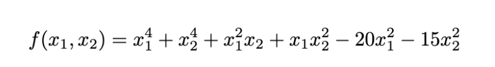
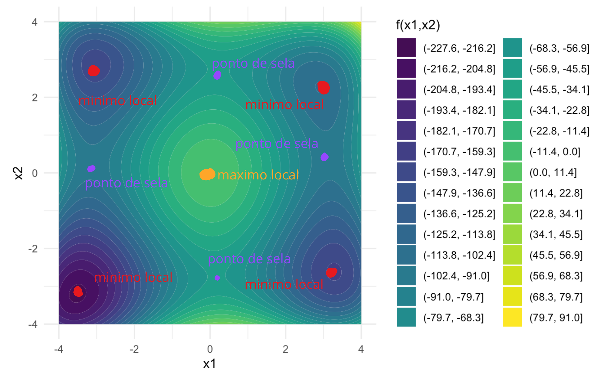
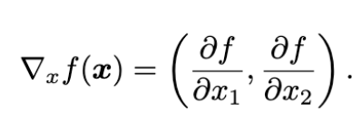
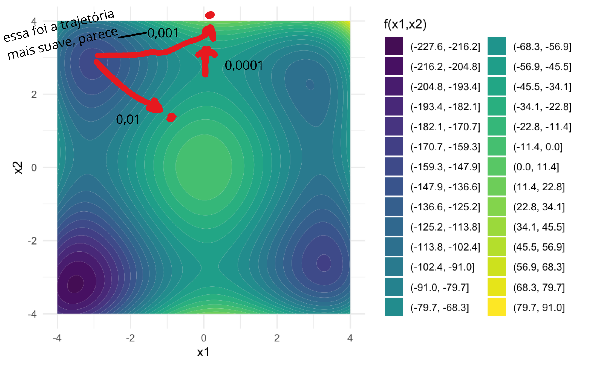

# Otimização de RNA

Considerando:



```{r}

#install.packages("plotly")
#install.packages("tidyverse")
```

```{r}

library(plotly)
library(tidyverse)

f <- function(x1, x2){
  x1^4 + x2^4 + x1^2*x2 + x1*x2^2 - 20*x1^2 - 15*x2^2
}
```

```{r}


# grade (ajuste o intervalo se quiser)
x1 <- seq(-4, 4, length.out = 160)
x2 <- seq(-4, 4, length.out = 160)

# matriz z: linhas = x1, colunas = x2
z <- outer(x1, x2, f)

plot_ly(x = x1, y = x2, z = z, type = "surface") |>
  layout(
    scene = list(
      xaxis = list(title = "x1"),
      yaxis = list(title = "x2"),
      zaxis = list(title = "f(x1,x2)")
    )
  )
```

## Letra A

Curvas de nível de f(x1,x2)

```{r}

grid <- expand.grid(
  x1 = seq(-4, 4, by = 0.02),
  x2 = seq(-4, 4, by = 0.02)
) |>
  as_tibble() |>
  mutate(z = f(x1, x2))

ggplot(grid, aes(x = x1, y = x2, z = z)) +
  geom_contour_filled(bins = 30) +
  coord_equal() +
  labs(x = "x1", y = "x2", fill = "f(x1,x2)") +
  theme_minimal()
```

```{r}

grid <- expand.grid(
  x1 = seq(-5, 5, by = 0.02),
  x2 = seq(-5, 5, by = 0.02)
) |>
  as_tibble() |>
  mutate(z = f(x1, x2))

ggplot(grid, aes(x = x1, y = x2, z = z)) +
  geom_contour_filled(bins = 30) +
  coord_equal() +
  labs(x = "x1", y = "x2", fill = "f(x1,x2)") +
  theme_minimal()
```

### Rabiscando na mão os pontos de interesse



## Letra B



(Ver resolução no papel e caneta)

## Letra C

Função computacional que implementa o método de gradiente para minimizar a função.

Tem que ter:

-   taxa de aprendizado

-   número de passos

-   ponto de partida

Ver resolução prévia que eu fiz na mão para mais detalhes.

```{r}

# derivada parcial 1
df_x1 <- function(x1, x2){
  return(4*x1^3 + 2*x1*x2 + x2^2 - 40*x1)
}

# derivada parcial 2
df_x2 <- function(x1, x2){
  return(4*x2^3 + x1^2 + 2*x1*x2 - 30*x2)
}

# em um k passo, taxa de aprendizado multiplicado por derivadas parciais naquele valor k
grad_step <- function(alpha, x1_k, x2_k){
  
  g1 <- df_x1(x1_k, x2_k)
  g2 <- df_x2(x1_k, x2_k)
  
  return(list(
    result_1 = alpha * g1,
    result_2 = alpha * g2
  ))
}

```

```{r}

# testando
print(df_x1(0,5))
print(df_x2(0,5))
a <- grad_step(0.01,0,5)$result_1
print(a)
b <- grad_step(0.01,0,5)$result_2
print(b)
```

```{r}

gradiente_min <- function(alpha, n_passos, x1_init, x2_init){
  
  hist <- matrix(NA, nrow = n_passos, ncol = 2)
  colnames(hist) <- c("x1", "x2")

  # inicializo x1 e x2 com os iniciais
  x1 <- x1_init
  x2 <- x2_init
  
  for (i in 1:n_passos) {
    
    # calculo alpha * derivada parcial 1 e alpha * derivada parcial 2
    step <- grad_step(alpha, x1, x2)
    
    # atualizo x1 e x2 com essa atualização de valor
    x1 <- x1 - step$result_1
    x2 <- x2 - step$result_2
    
    # histórico
    hist[i, ] <- c(x1, x2)
    
  }
  
  return(list(
    hist_min = hist,
    x1_min = x1,
    x2_min = x2
  ))
}
```

## Letra D

x1_init = 0

x2_init = 5

alpha = 0.01

n_passos = 100

```{r}

result <- gradiente_min(0.01, 100, 0, 5)
```

```{r}

result$x1_min
result$x2_min
```

```{r}

hist_df <- as_tibble(result$hist_min) |>
  mutate(iter = row_number())

# trajetória (x1 vs x2)
ggplot(hist_df, aes(x = x1, y = x2)) +
  geom_path() +
  geom_point(size = 2) +
  annotate(
    "point",
    x = hist_df$x1[1],
    y = hist_df$x2[1],
    shape = 4,
    size = 4,
    stroke = 1.2
  ) +
  annotate(
    "point",
    x = hist_df$x1[nrow(hist_df)],
    y = hist_df$x2[nrow(hist_df)],
    shape = 16,
    size = 3
  ) +
  coord_equal() +
  labs(
    x = "x1",
    y = "x2",
    title = "Trajetória do gradiente (início e fim)"
  ) +
  theme_minimal()

```

## Letra E

Agora variando taxa de aprendizado:

-   1

-   0.1

-   0.01

-   0.001

-   0.0001

```{r}

result1 <- gradiente_min(1, 100, 0, 5)
result2 <- gradiente_min(0.1, 100, 0, 5)
result3 <- gradiente_min(0.01, 100, 0, 5)
result4 <- gradiente_min(0.001, 100, 0, 5)
result5 <- gradiente_min(0.0001, 100, 0, 5)
```

```{r}

hist_df1 <- as_tibble(result1$hist_min) |>
  mutate(iter = row_number())

hist_df2 <- as_tibble(result2$hist_min) |>
  mutate(iter = row_number())

hist_df3 <- as_tibble(result3$hist_min) |>
  mutate(iter = row_number())

hist_df4 <- as_tibble(result4$hist_min) |>
  mutate(iter = row_number())

hist_df5 <- as_tibble(result5$hist_min) |>
  mutate(iter = row_number())

# 1


hist_df1 <- hist_df1 |>
  filter(is.finite(x1), is.finite(x2))

ggplot(hist_df1, aes(x = x1, y = x2)) +
  geom_path() +
  geom_point(size = 2) +
  annotate(
    "point",
    x = hist_df1$x1[1],
    y = hist_df1$x2[1],
    shape = 4,
    size = 4,
    stroke = 1.2
  ) +
  annotate(
    "point",
    x = hist_df1$x1[nrow(hist_df)],
    y = hist_df1$x2[nrow(hist_df)],
    shape = 16,
    size = 3
  ) +
  coord_equal() +
  labs(
    x = "x1",
    y = "x2",
    title = "Trajetória do gradiente (1)"
  ) +
  theme_minimal()

# 0.1

hist_df2 <- hist_df2 |>
  filter(is.finite(x1), is.finite(x2))

ggplot(hist_df2, aes(x = x1, y = x2)) +
  geom_path() +
  geom_point(size = 2) +
  annotate(
    "point",
    x = hist_df2$x1[1],
    y = hist_df2$x2[1],
    shape = 4,
    size = 4,
    stroke = 1.2
  ) +
  annotate(
    "point",
    x = hist_df2$x1[nrow(hist_df)],
    y = hist_df2$x2[nrow(hist_df)],
    shape = 16,
    size = 3
  ) +
  coord_equal() +
  labs(
    x = "x1",
    y = "x2",
    title = "Trajetória do gradiente (0.1)"
  ) +
  theme_minimal()

# 0.01
ggplot(hist_df3, aes(x = x1, y = x2)) +
  geom_path() +
  geom_point(size = 2) +
  annotate(
    "point",
    x = hist_df3$x1[1],
    y = hist_df3$x2[1],
    shape = 4,
    size = 4,
    stroke = 1.2
  ) +
  annotate(
    "point",
    x = hist_df3$x1[nrow(hist_df)],
    y = hist_df3$x2[nrow(hist_df)],
    shape = 16,
    size = 3
  ) +
  coord_equal() +
  labs(
    x = "x1",
    y = "x2",
    title = "Trajetória do gradiente (0.01)"
  ) +
  theme_minimal()

# 0.001

hist_df4 <- hist_df4 |>
  filter(is.finite(x1), is.finite(x2))

ggplot(hist_df4, aes(x = x1, y = x2)) +
  geom_path() +
  geom_point(size = 2) +
  annotate(
    "point",
    x = hist_df4$x1[1],
    y = hist_df4$x2[1],
    shape = 4,
    size = 4,
    stroke = 1.2
  ) +
  annotate(
    "point",
    x = hist_df4$x1[nrow(hist_df)],
    y = hist_df4$x2[nrow(hist_df)],
    shape = 16,
    size = 3
  ) +
  coord_equal() +
  labs(
    x = "x1",
    y = "x2",
    title = "Trajetória do gradiente (0.001)"
  ) +
  theme_minimal()

# 0.0001

# limpeza mínima (evita NA/Inf)
hist_df5_ok <- hist_df5 |>
  filter(is.finite(x1), is.finite(x2))

n <- nrow(hist_df5_ok)

ggplot(hist_df5_ok, aes(x = x1, y = x2)) +
  geom_path(linewidth = 1) +
  geom_point(size = 1.2) +
  annotate(
    "point",
    x = hist_df5_ok$x1[1],
    y = hist_df5_ok$x2[1],
    shape = 4,
    size = 4,
    stroke = 1.2
  ) +
  annotate(
    "point",
    x = hist_df5_ok$x1[n],
    y = hist_df5_ok$x2[n],
    shape = 16,
    size = 3
  ) +
  coord_equal() +
  coord_cartesian(
    xlim = range(hist_df5_ok$x1) + c(-0.1, 0.1),
    ylim = range(hist_df5_ok$x2) + c(-0.1, 0.1)
  ) +
  labs(
    x = "x1",
    y = "x2",
    title = "Trajetória do gradiente (0.0001)"
  ) +
  theme_minimal()

```

Taxas de aprendizado

1 - divergiu

0.1 - divergiu

0.01 - passo muito grande?

0.001 - mais sauve, segue curva do vale \<- esse seria o valor escolhido!

0.0001 - mais lento, estável



## Letra F 

```{r}

set.seed(123)

iniciais <- tibble(
  id = 1:20,
  x1_init = runif(20, min = -5, max = 5),
  x2_init = runif(20, min = -5, max = 5)
)

```

```{r}

alpha <- 0.001
n_passos <- 5000

# objetos para guardar resultados finais
x1_final <- numeric(20)
x2_final <- numeric(20)

hist_all <- data.frame()

for (i in 1:20) {
  
  res <- gradiente_min(
    alpha = alpha,
    n_passos = n_passos,
    x1_init = iniciais$x1_init[i],
    x2_init = iniciais$x2_init[i]
  )
  
  x1_final[i] <- res$x1_min
  x2_final[i] <- res$x2_min
  
  hist_i <- as.data.frame(res$hist_min)
  colnames(hist_i) <- c("x1", "x2")

  hist_i$run  <- i
  hist_i$iter <- 1:nrow(hist_i)

  hist_all <- rbind(hist_all, hist_i)
}

```

```{r}

resultados <- data.frame(
  x1_init = iniciais$x1_init,
  x2_init = iniciais$x2_init,
  x1_final = x1_final,
  x2_final = x2_final
)

resultados

```

```{r}


ggplot(grid, aes(x = x1, y = x2, z = z)) +
  geom_contour_filled(bins = 30) +
  geom_point(
    data = resultados,
    aes(x = x1_final, y = x2_final),
    inherit.aes = FALSE,
    color = "red",
    size = 3
  ) +
  coord_equal() +
  labs(
    x = "x1",
    y = "x2",
    fill = "f(x1,x2)",
    title = "Curvas de nível com pontos finais do gradiente"
  ) +
  theme_minimal()

```

```{r}

ggplot(grid, aes(x = x1, y = x2, z = z)) +
  geom_contour_filled(bins = 30) +
  geom_path(
    data = hist_all,
    aes(x = x1, y = x2, group = run),
    inherit.aes = FALSE,
    color = "black",
    linewidth = 0.6
  ) +
  geom_point(
    data = hist_all,
    aes(x = x1, y = x2, group = run),
    inherit.aes = FALSE,
    color = "black",
    size = 1
  ) +
  coord_equal() +
  labs(
    x = "x1",
    y = "x2",
    fill = "f(x1,x2)",
    title = "Curvas de nível com trajetórias do gradiente"
  ) +
  theme_minimal()


```

Todos convergem, mas nem todos convergem para o mesmo mínimo!

## Letra G

Repetindo letra D, fazendo gradiente com momento

```{r}


```

## Letra H

Repetindo letra D, fazendo gradiente RMSProp

```{r}


```

## Letra I

Repetindo letra D, fazendo gradiente Adam

```{r}


```

## Letra J

Grafico dos passos nas letras d, g, h, i

```{r}


```
