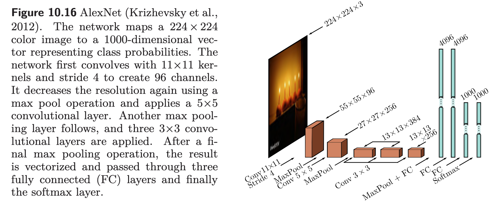
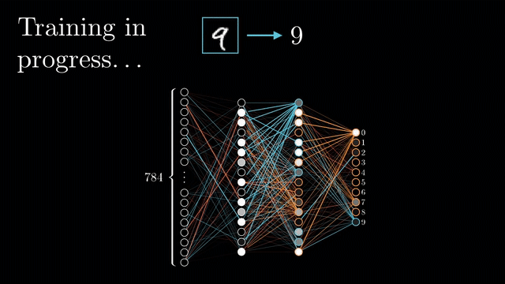
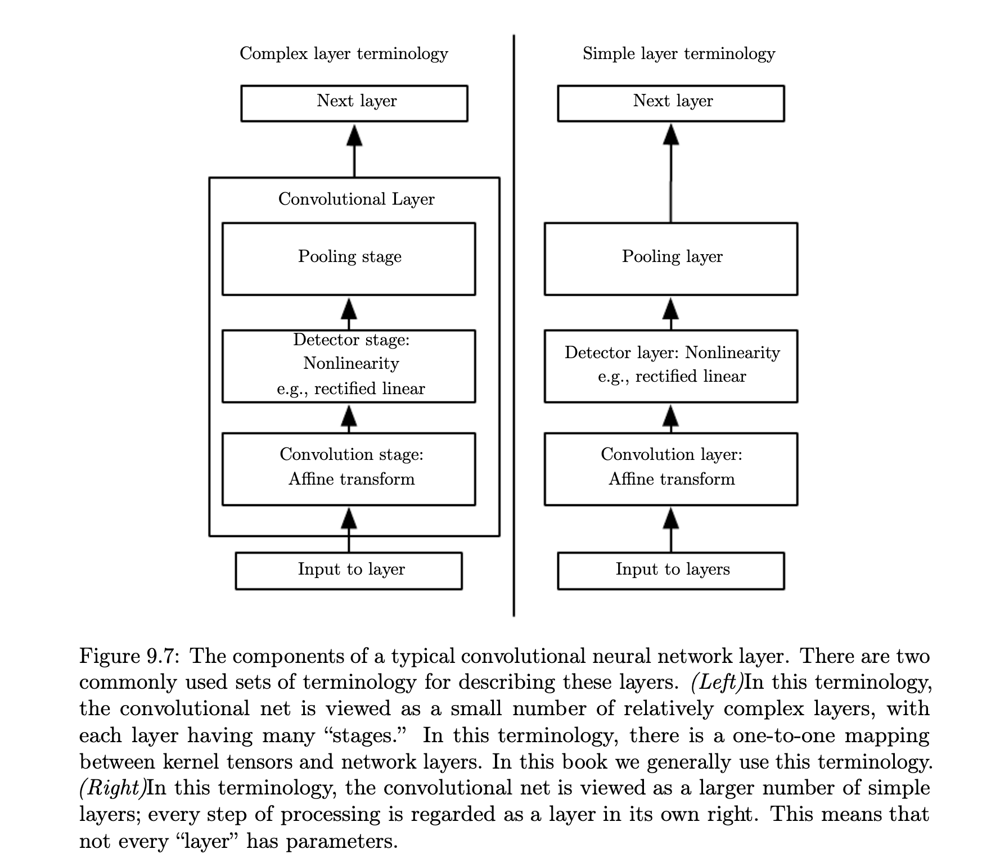
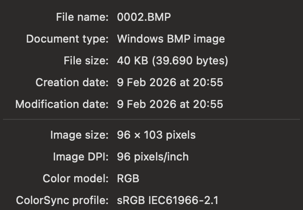

# CNN do Zero

A lista 4 pede para fazer uma rede neural convolucional para acertar o sexo de um indivíduo dado a imagem de sua digital. É disponibilizado um dataset de 4000 imagens.

*"Nosso objetivo, portanto, é maximizar a probabilidade de acerto do modelo em imagens não utilizadas no processo de treinamento."*

## Mas como eu decido o tamanho da minha rede?

Eu sempre tive essa dúvida: como eu começo a projetar a minha rede? Quantas camadas intermediárias? Camada de ativação? Quantos neurônios? Pesquisei e eu preciso responder de forma objetiva baseado no que eu sequer quero atingir ao final da minha implementação.

A Lista 4 menciona algumas variáveis que fixam a natureza do meu problema:

-   O dataset que vou usar são de digitais de 400 pessoas. Dados que parecem ter padrões repetitivos, não imagino que sejam imagens enormes e coloridas. Será que 4000 não é pouco? Não daria para fazer uma rede enorme. Seria o caso de eu ver no livro do Ian Goodfellow uma arquitetura pequena e genérica para ver se é um pontapé inicial bom.

-   É um problema de classificação binária: isso meio que me direciona para uma sigmoid simples e uma perda binária tipo binary cross-entropy, que é meio típica para esse tipo de coisa.

-   Uma CNN é capaz de lidar com abstrações altas. Não precisaria de muitas camadas que façam muitas convoluções para identificar features em um rosto como olhos e bocas, seriam coisas mais locais como padrões na digital de uma pessoa. Lógico, preciso de algumas camadas, mas tudo me indica que não vou fazer uma rede enorme. Isso me faz lembrar da matéria de redes 2 (que eu fiz antes de redes 1) em que vimos modelos de CNN mais complexos do livro [Understanding Deep Learning](https://udlbook.github.io/udlbook/?hl=en).



Alexnet era uma rede de 8 camadas escondidas com ativação ReLu (primeiros 5 são convolucionais e o resto *fully connected*) com 60 bilhões de parâmetros no total. Não acho que seja inteligente chegar perto disso, então tenho mapeado para qual caminho não ir.

Para um toy example de classificação de números do dataset MNIST, eu tenho algo mais parecido com [isso aqui](https://www.3blue1brown.com/lessons/gradient-descent):

\


O que me reforça, uns 3 blocos convolucionais f*ully connected* podem ser o ponto de partida que eu quero. Não que essa rede seja uma **CNN** tradicional, mas eu preciso de um chute inicial.

Vou usar o bloco de camada convolucional padrão que tem no livro do Ian Goodfellow:



Que parece com algo assim: Convolução, Relu, Pooling.

Quem erra rápido pode consertar rápido, então hora de ver os dados.

## Dataset

O link original é [esse](https://1drv.ms/f/s!Aiqt4i7wEOAe24dzk9tyQQ) mas eu vou guardar no meu [Drive](https://drive.google.com/file/d/1qUkvfEjjY7E8sfbWWUy8R5KyY9sI1EAt/view?usp=sharing) porque o download do OneDrive é meio lento. Está na pasta **Dados**.

*"Os nomes dos arquivos do conjunto de teste estão no formato “Sexo_Indice” (por exemplo, “F_0001” corresponde a primeira foto de uma pessoa do sexo feminino). Para viabilizar o exercício, o sexo das imagens do conjunto de teste não foi disponibilizado."*

Uma imagem do dataset parece assim:

\




Ela tem 96 × 103 pixels e é um BMP em RGB, tenho a impressão que o certo é manipular isso em *grayscale*.

Essa imagem já está em *grayscale*?

```{r}

install.packages("imager")


```

```{r}

library(stringr)
library(imager)

```

```{r}

# O imager carregou direito?
img <- as.cimg(matrix(runif(96*103), 96, 103))
plot(img)

```

Tudo certo!

```{r}

img_dir <- "Dados/Treino"

arquivos <- list.files(
  path = img_dir,
  pattern = "\\.BMP$",
  full.names = TRUE
)

length(arquivos)   # deve dar 4000

```

```{r}

dados <- tibble::tibble(
  path = arquivos,
  filename = basename(arquivos),
  sexo = str_extract(filename, "^[FM]"),
  id = as.integer(str_extract(filename, "\\d+"))
)

table(dados$sexo)
```

Dataset bem desbalanceado...

```{r}

ler_imagem <- function(path) {
  img <- load.image(path)
  img
}

# exemplo: ler a primeira
#img_exemplo <- ler_imagem(dados$path[1])
#plot(img_exemplo)

```

Erro pois meu BMP está com compressão...

Mas essa forma de ler aqui funciona!

```{r}

install.packages("magick")
library(magick)

```

```{r}

img <- image_read("Dados/Treino/F_0015.BMP")
# converte para array [altura, largura, canais]
arr <- as.integer(image_data(img, channels = "gray")) / 255
dim(arr)

```

Vamos ler tudo então!

```{r}


library(magick)
library(stringr)

dir_treino <- "Dados/Treino"

arquivos <- list.files(dir_treino, pattern = "\\.bmp$", full.names = TRUE, ignore.case = TRUE)

dados <- data.frame(
  path = arquivos,
  filename = basename(arquivos),
  stringsAsFactors = FALSE
)

dados$sexo <- str_extract(dados$filename, "^[FM]")
dados$id   <- as.integer(str_extract(dados$filename, "\\d+"))

stopifnot(all(!is.na(dados$sexo)))
table(dados$sexo)

```

#### Função - Ler 1 Imagem

```{r}

ler_bmp_gray_matrix <- function(path, width = 96, height = 103) {
  img <- image_read(path)

  # garante tamanho fixo (ignora proporção; é o baseline mais simples)
  img <- image_resize(img, geometry = paste0(width, "x", height, "!"))

  # canais="gray" retorna [1, width, height] como raw (0..255)
  arr <- image_data(img, channels = "gray")

  # converte para numeric [0,1]
  m <- as.numeric(arr[1,,]) / 255

  # arr vem como [width, height]; converte para [height, width]
  t(m)
}
```

#### Lendo tudo

```{r}

n <- nrow(dados)

X <- array(0, dim = c(n, 103, 96, 1))  # (samples, height, width, channels)
y <- ifelse(dados$sexo == "M", 1, 0)

for (i in seq_len(n)) {
  if (i %% 50 == 0) message("Lendo ", i, "/", n)
  X[i,,,1] <- ler_bmp_gray_matrix(dados$path[i], width = 96, height = 103)
}

dim(X)
table(y)

```

Cada *X[i,,,]* corresponde a *dados[i,]* e a *y[i].*

```{r}

i <- 1
image(t(X[i,,,1]), col = gray.colors(256), axes = FALSE,
      main = paste(dados$sexo[i], dados$filename[i]))

```

O dado tá ai.

## Tentando fazer minha rede

### Arquitetura básica de primeiro teste

-   Entra imagem

    -   1 x 93 x 103

-   Bloco 1

    -   Convolução 2d -\> 32 filtros, *padding* constante

    -   Relu

    -   Maxpool 2x2

    -   32 x 93/2 x 103/2 = 32 x 48 x 51

-   Bloco 2

    -   Convolução 2d -\> 64 filtros, *padding* constante

    -   Relu

    -   Maxpool 2x2

    -   64 x 48/2 x 51/2 = 64 x 24 x 25

-   Bloco 3

    -   Convolução 2d -\> 128 filtros, *padding* constante

    -   Relu

    -   Maxpool 2x2

    -   128 x 24/2 x 25/2 = 128 x 12 x 12

-   Camada Densa

    -   ReLU

    -   128

-   Camada Densa

    -   Sigmoid

    -   1

    -   Sai classificação de digital de homem ou de mulher

Suponho que é um bom sinal isso convergir no treino. E que o treino tenha um tempo razoável. Underfitting seria o final forte de que essa rede não é complexa o suficiente para abstrair o problema. Mas me baseando nos problemas prévios observados, pode ser um bom ponto de partida.

```{r}

install.packages("keras")
library(keras)
```

```{r}

model <- keras_model_sequential(name = "cnn_fingerprint")

# Bloco 1 (defina input_shape aqui)
model$add(layer_conv_2d(
  filters = 32, kernel_size = c(3, 3),
  padding = "same", activation = "relu",
  input_shape = c(93, 103, 1),
  name = "conv1"
))
model$add(layer_max_pooling_2d(pool_size = c(2, 2), name = "pool1"))

# Bloco 2
model$add(layer_conv_2d(
  filters = 64, kernel_size = c(3, 3),
  padding = "same", activation = "relu",
  name = "conv2"
))
model$add(layer_max_pooling_2d(pool_size = c(2, 2), name = "pool2"))

# Bloco 3
model$add(layer_conv_2d(
  filters = 128, kernel_size = c(3, 3),
  padding = "same", activation = "relu",
  name = "conv3"
))
model$add(layer_max_pooling_2d(pool_size = c(2, 2), name = "pool3"))

# Cabeça
model$add(layer_flatten(name = "flatten"))
model$add(layer_dense(units = 128, activation = "relu", name = "dense1"))
model$add(layer_dense(units = 1, activation = "sigmoid", name = "out"))

model$compile(
  optimizer = optimizer_adam(learning_rate = 1e-3),
  loss = loss_binary_crossentropy(),
  metrics = list(metric_binary_accuracy(name = "accuracy"))
)

summary(model)

```

```{r}

# treinando
```

## Otimizando

*"Use as ferramentas disponíveis para melhorar o desempenho do modelo, incluindo, entre outras, a **criação de dados sintéticos**, computação em nuvem, dropout, batch normalization, boosting, bagging e autoML."*

Dados sintéticos veio no pedido do exercício em negrito, e realmente, parece que tem pouco dado...

### Dados sintéticos

```{r}


```
